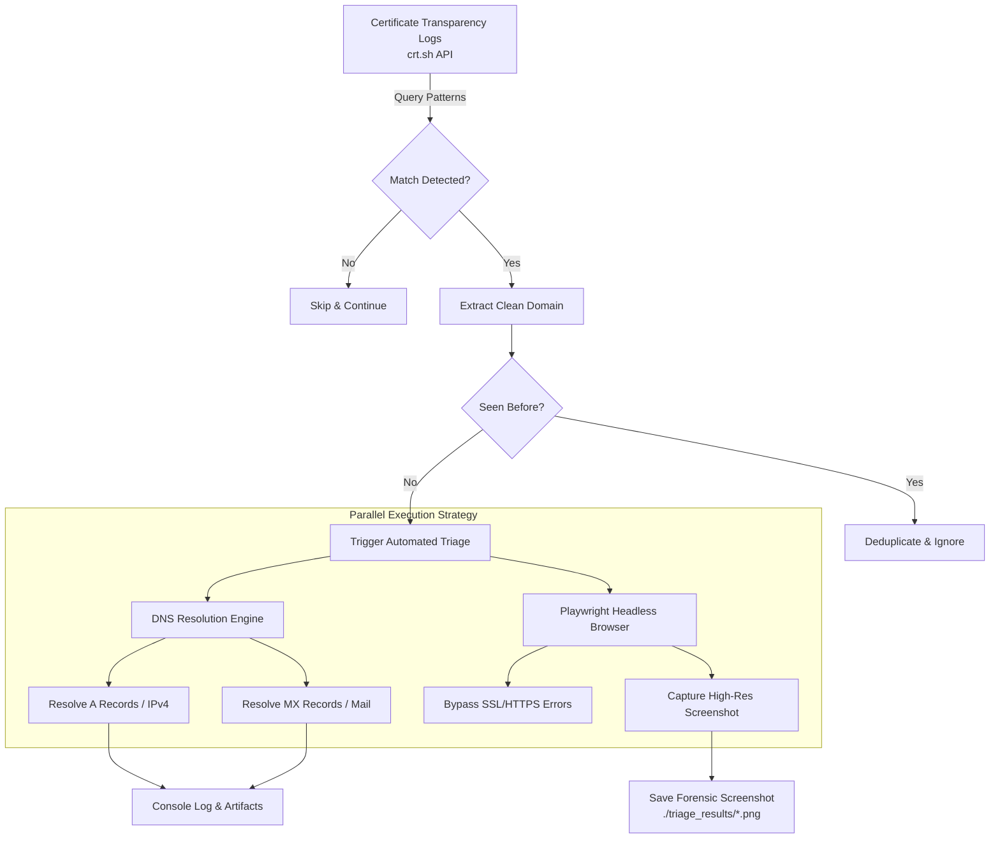

# CT Monitor & Triage Engine

An automated threat intelligence and detection engineering project designed to eliminate manual report-writing overhead by implementing **Intel-Driven Engineering**. 

This system passively monitors Certificate Transparency (CT) logs in real time to identify suspicious, typosquatted, or phishing domain registrations. Once a matching domain is detected, the engine executes fully automated, hands-free technical triage, DNS resolution, and visual evidence collection.

---

## Key Features

* **Targeted CT Log Monitoring:** Continuously queries Certificate Transparency logs (`crt.sh`) for specific brand impersonation patterns and phishing keywords.
* **Automated DNS Resolution:** Extracts `A` (IPv4) and `MX` (Mail Exchange) records dynamically for each flagged infrastructure asset.
* **Headless Visual Capture:** Uses Playwright (Chromium) to safely render target HTTP endpoints and capture full-page forensic screenshots without manual browser intervention.
* **Deduplication Logic:** Maintains an in-memory execution state (`seen_domains`) to avoid redundant analysis of previously triaged domains.
* **Batch & Daily Execution Ready:** Designed to run seamlessly as an automated daily batch job via `cron` or on-demand via CLI.

---
## Architecture & Technical Workflow



---

## Prerequisites & Environment Setup

### 1. System Dependencies (Ubuntu / Debian Linux)
```bash
sudo apt update && sudo apt install -y python3 python3-pip python3-venv
```
### 2. Python Environment & Libraries
### Set up Python Virtual Environment
```python
python3 -m venv venv
source venv/bin/activate
```
# Install Required Dependencies
```python
pip install requests dnspython playwright
```
# Install Headless Chromium Binary
```python
playwright install chromium
playwright install-deps
```

## Usage
### Run the triage engine via command line:
```python
python3 app.py
```

## Project Structure
```
cti-triage-system/
├── app.py              # Core Triage & Monitoring Engine
├── README.md           # Project Documentation
└── triage_results/     # Output Directory storing captured evidence screenshots
```
